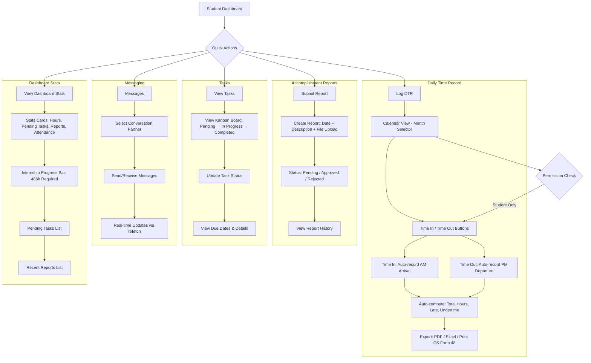
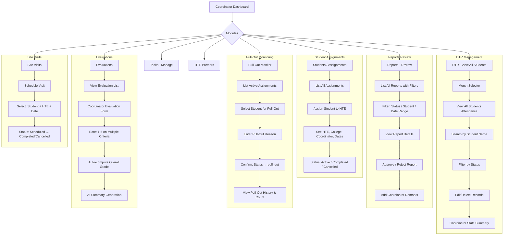
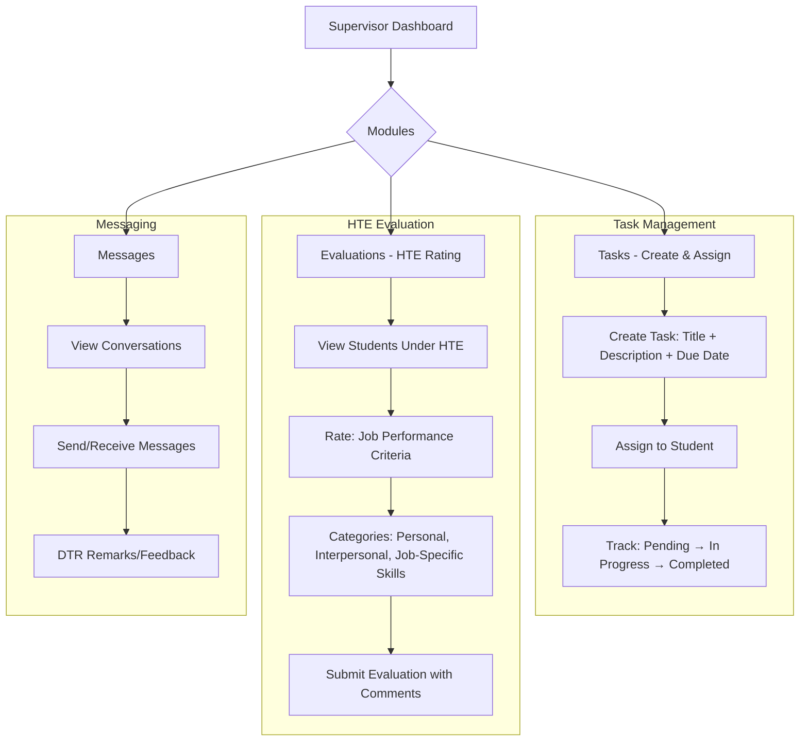
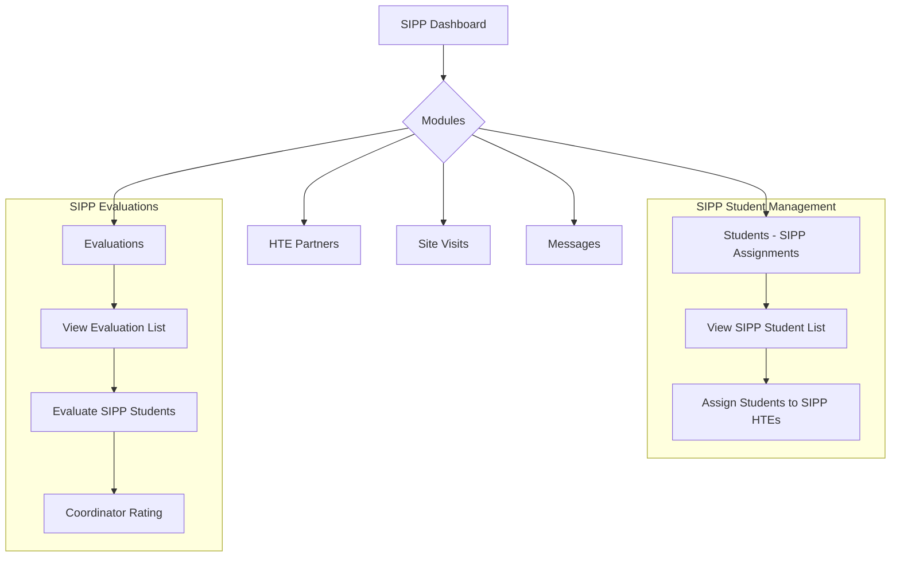
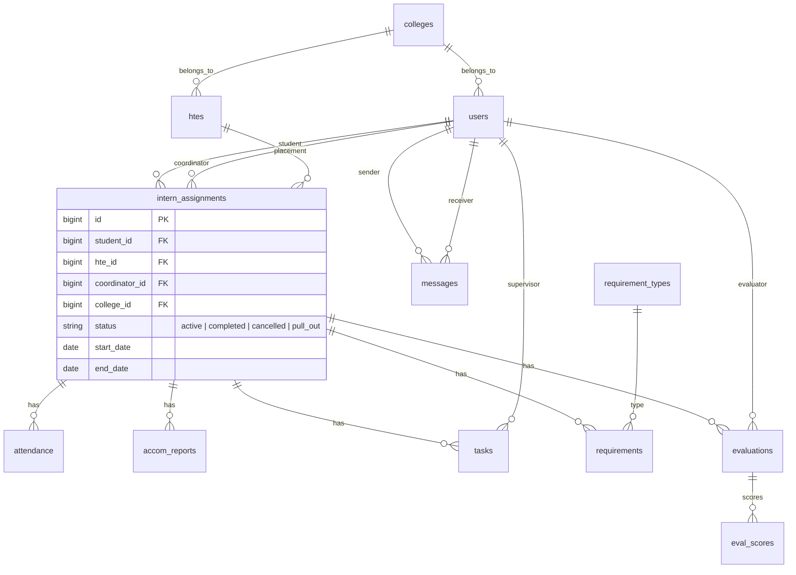
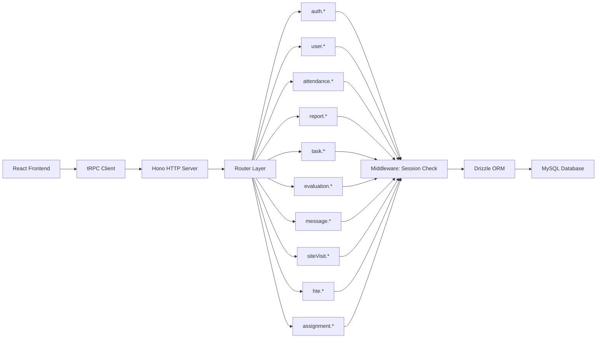
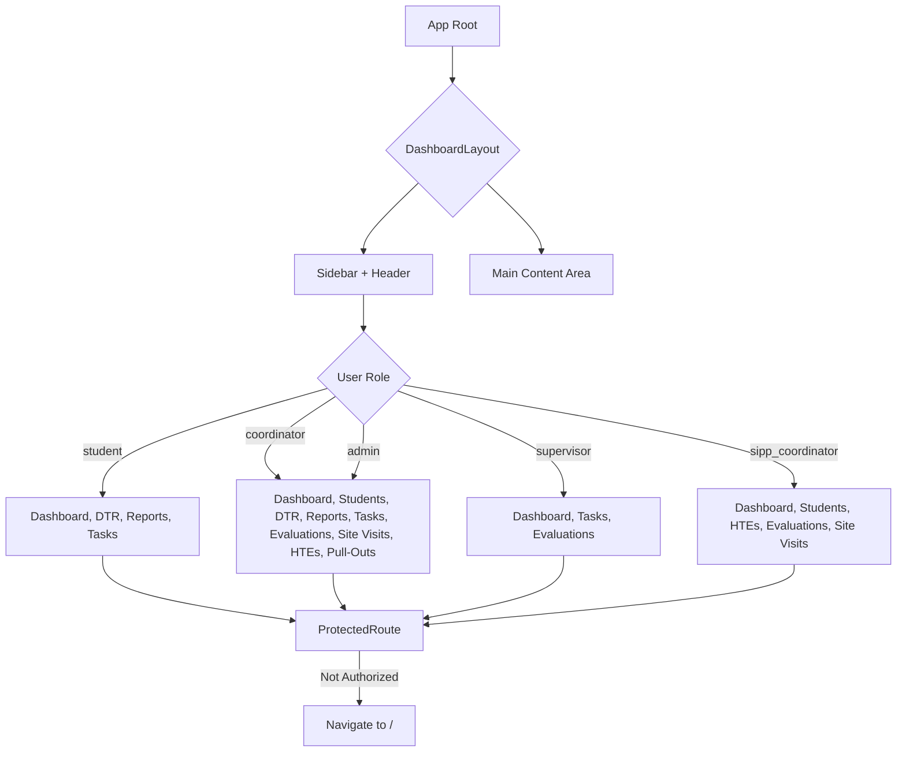

# BISU Internship Management System — Mobile App Flow

## 📱 Overview

Ang mobile app sa BISU Internship Management System kay usa ka role-based application nga naga-serve sa **Student**, **Coordinator**, **Supervisor**, **SIPP Coordinator**, ug **Admin**. Ang system kay built gamit ang React + Vite + tRPC + MySQL (via Drizzle ORM).

---

## 🔐 1. Authentication Flow

```mermaid
flowchart TD
    A[Open App] --> B{Is Authenticated?}
    B -->|No| C[Login Page]
    B -->|Yes| D[Role-Based Redirect]
    
    C --> E[Enter Email/Student ID & Password]
    E --> F[Submit Login]
    F --> G{tRPC: auth.login}
    G -->|Success| H[Set Session/Cookie]
    H --> I[Invalidate auth.me query]
    I --> D
    G -->|Failed| J[Show Error Message]
    J --> E
    
    D --> K{User Role}
    K -->|student| L[/student/dashboard]
    K -->|coordinator| M[/coordinator/dashboard]
    K -->|supervisor| N[/supervisor/dashboard]
    K -->|sipp_coordinator| O[/sipp/dashboard]
    K -->|admin| M
    
    L --> P{Logout?}
    M --> P
    N --> P
    O --> P
    P -->|Yes| Q[tRPC: auth.logout]
    Q --> R[Clear Session]
    R --> C
```

### Auth Implementation Details:
- **Hook:** `src/hooks/useAuth.ts` — wraps tRPC `auth.me` query
- **API:** `api/auth-router.ts` — handles login/logout
- **Session:** JWT-based via cookies (`jose` library)
- **Stale Time:** 5 minutes for user data caching
- **Auto-redirect:** `ProtectedRoute` component checks allowed roles

---

## 👤 2. Student Flow



### Student Routes:
| Path | Component | Description |
|------|-----------|-------------|
| `/student/dashboard` | `StudentDashboard` | Stats, quick actions, pending tasks, recent reports |
| `/student/dtr` | `DTRPage` | Monthly calendar, **Time In/Time Out**, CS Form 48 export |
| `/student/reports` | `ReportsPage` | CRUD accomplishment reports with file upload |
| `/student/tasks` | `TasksPage` | Kanban board for assigned tasks |
| `/student/messages` | `MessagesPage` | Direct messaging with supervisor/coordinator |

---

## 👔 3. Coordinator Flow



### Coordinator Routes:
| Path | Component | Description |
|------|-----------|-------------|
| `/coordinator/dashboard` | `CoordinatorDashboard` | Overview stats |
| `/coordinator/students` | `AssignmentsPage` | Assign students to HTEs |
| `/coordinator/dtr` | `DTRPage` | View & manage all student DTRs |
| `/coordinator/reports` | `ReportsPage` | Approve/reject accomplishment reports |
| `/coordinator/tasks` | `TasksPage` | Create & manage tasks for students |
| `/coordinator/evaluations` | `EvaluationsPage` | Evaluate student performance |
| `/coordinator/visits` | `SiteVisitsPage` | Schedule & track site visits |
| `/coordinator/htes` | `HTEsPage` | Manage HTE partners |
| `/coordinator/pullouts` | `PullOutMonitoring` | Monitor pulled-out students |

---

## 🔧 4. Supervisor Flow



### Supervisor Routes:
| Path | Component | Description |
|------|-----------|-------------|
| `/supervisor/dashboard` | `SupervisorDashboard` | Overview |
| `/supervisor/tasks` | `TasksPage` | Assign & track student tasks |
| `/supervisor/evaluations` | `EvaluationsPage` | HTE-side evaluation |
| `/supervisor/messages` | `MessagesPage` | Communicate with students/coordinator |

---

## 🏫 5. SIPP Coordinator Flow



### SIPP Routes:
| Path | Component | Description |
|------|-----------|-------------|
| `/sipp/dashboard` | `SippDashboard` | SIPP-specific dashboard |
| `/sipp/students` | `AssignmentsPage` | Manage SIPP student assignments |
| `/sipp/htes` | `HTEsPage` | SIPP HTE partners |
| `/sipp/evaluations` | `EvaluationsPage` | SIPP evaluations |
| `/sipp/visits` | `SiteVisitsPage` | SIPP site visits |
| `/sipp/messages` | `MessagesPage` | Messaging |

---

## 🗄️ 6. Database Schema Flow



---

## 🌐 7. API Data Flow



### tRPC Router Structure:
```
appRouter
├── ping              # Health check
├── auth              # Login, logout, me
├── user              # User CRUD
├── attendance        # DTR: list, create, update, delete, getToday, getSummary, timeIn, timeOut
├── report            # Accomplishment reports CRUD + review
├── task              # Tasks: list, create, update status
├── evaluation        # Evaluations: list, create, scores, AI summary
├── message           # Messaging: send, list conversations, get thread
├── siteVisit         # Site visits: list, create, update status
├── hte               # HTE partners: list, create
└── assignment        # Intern assignments: list, create, pull-out
```

---

## 📱 8. Navigation & Sidebar Menu Flow



---

## 📋 9. Component Data Dependencies

| Page | tRPC Queries | tRPC Mutations | Key State |
|------|-------------|----------------|-----------|
| `DTRPage` | `attendance.list`, `attendance.getToday`, `attendance.getInternshipProgress`, `attendance.getSupervisorRemarks`, `attendance.coordinatorList`, `attendance.getCoordinatorStats`, `attendance.getStudentAttendance` | `attendance.create`, `attendance.update`, `attendance.delete`, `attendance.timeIn`, `attendance.timeOut` | `selMonth`, `dialogOpen`, `editId`, `formData`, `searchTerm`, `filterStatus` |
| `ReportsPage` | `report.list`, `report.studentReports` | `report.create`, `report.updateStatus`, `report.addRemarks` | `selMonth`, `dialogOpen`, `reviewOpen`, `searchTerm`, `filterStatus`, `filterStudent`, `dateRange` |
| `TasksPage` | `task.list` | `task.create`, `task.update` | `open`, `formData` |
| `EvaluationsPage` | `evaluation.list`, `evaluation.getCriteria` | `evaluation.create`, `evaluation.submitScore` | Tab selection, rating state, dialog open |
| `MessagesPage` | `message.listConversations`, `message.getThread` | `message.send` | `selectedPartner`, `messageInput` |
| `SiteVisitsPage` | `siteVisit.list` | `siteVisit.create` | `open`, `formData` |
| `HTEsPage` | `hte.list` | `hte.create` | `open`, `formData` |
| `AssignmentsPage` | `assignment.list` | `assignment.create` | `open`, `formData` |
| `PullOutMonitoring` | `assignment.list`, `assignment.pullOutList`, `assignment.pullOutCount` | `assignment.pullOutStudent` | `searchTerm`, `pullOutReason` |

---

## ⚙️ 10. Key Business Rules Flow

### DTR Computation:
```
AM Hours = AM Departure - AM Arrival
PM Hours = PM Departure - PM Arrival
Total Daily Hours = AM Hours + PM Hours
Late Minutes = max(0, AM Arrival - 08:00)
Monthly Total = Sum of all daily hours
Attendance Rate = (Present Days / Total Weekdays) × 100
```

### Time In / Time Out Flow:
```
Time In  → Auto-sets AM Arrival to current time (HH:MM)
Time Out → Auto-sets PM Departure to current time (HH:MM)
           If no AM Arrival yet, also sets AM Arrival
           Auto-computes undertime
           Status auto-set to "present" or "late"
```

### Evaluation Scoring:
```
Per Criteria Rating: 1 (Lowest) to 5 (Highest)
Category Average = Sum of items / Number of items
Overall Rating = Average of all categories
HTE Weight + Coordinator Weight = Overall Grade
```

### Internship Progress:
```
Required Hours: 486 hours
Progress % = (Completed Hours / 486) × 100
Status: On Track (< 100%) → Completed (≥ 100%)
```

### Pull-Out Process:
```
Active Assignment → Coordinator Initiates Pull-Out → 
Enter Reason → Status Changes to "pull_out" → 
Student Re-assignable to New HTE